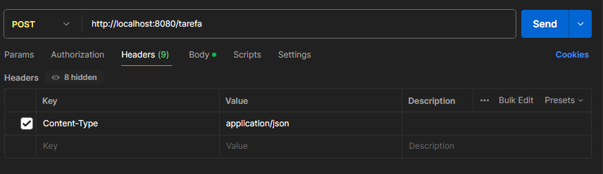

# KotlinToDoAPI

KotlinToDoAPI é uma API REST simples para gerenciar listas de tarefas, construída com Kotlin e Spring Boot. ✅

Este projeto foi feito após a conclusão do curso "API REST com Kotlin e Spring Boot: Camada Web" da Alura, com o
objetivo de colocar em prática os conceitos que aprendi. 💪

## Funcionalidades

- [X] Criar Tarefa
- [X] Listar Tarefas
- [X] Buscar Tarefa por ID
- [X] Atualizar Tarefa
- [X] Excluir Tarefa

## Dependências

- Spring Web
- Spring Boot DevTools
- Validation

## Endpoints

> Todos os métodos já estão implementados no Postman. Importe essa API 🌐
> https://bit.ly/3xDdiMN

| Método HTTP | Endpoint      | Função                               |
|-------------|---------------|--------------------------------------|
| GET         | /tarefa       | Retorna todas as tarefas             |
| GET         | /tarefa/{id}  | Retorna uma tarefa específica por ID |
| GET         | /usuario      | Retorna todos os usuários            |
| GET         | /usuario/{id} | Retorna um usuário específico por ID |
| POST        | /tarefa       | Cria uma nova tarefa                 |
| DELETE      | /tarefa/{id}  | Delete uma tarefa específica por ID  |
| DELETE      | /usuario/{id} | Delete um usuário específico por ID  |

### Informações Importantes

#### POST

- Ao utilizar o método POST lembre-se de utilizar os headers Key e Value sendo respectivamente *Content-Type* e
  *application/json*



- O modelo do JSON para o método POST deve ser o seguinte:

```json
{
  "idUsuario": 1,
  "titulo": "Tarefa 1",
  "descricao": "Corrigir código"
}
```

```json
{
  "nome": "Fulano de Tal",
  "email": "fulano@email.com"
}
```

#### PUT

- O modelo do JSON para o método PUT deve ser o seguinte:

```json
{
  "id": 1,
  "titulo": "Novo titulo",
  "descricao": "Nova Descrição"
}
```
